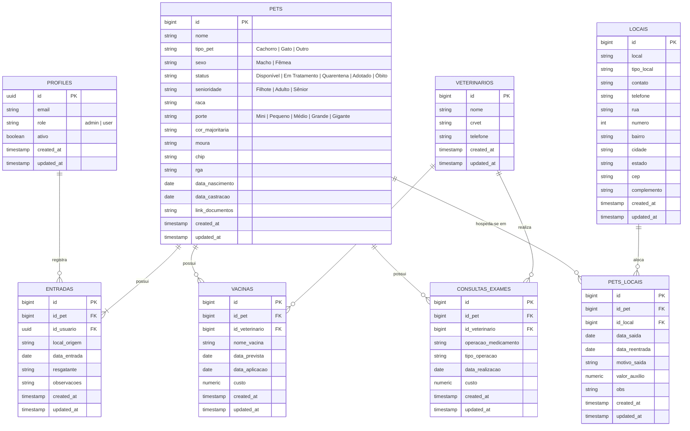

# Documento de Elicitação e Especificação de Requisitos de Software
## Sistema de Gestão para ONGs e Abrigos de Proteção Animal (*Peludinhos do Vale*)

---

**Instituição:** Universidade Feevale  
**Curso:** Engenharia da Computação  
**Trabalho de Conclusão de Curso (TCC)**  
**Projeto:** DESENVOLVIMENTO E VALIDAÇÃO DE SOFTWARE DE GERENCIAMENTO DE DADOS CADASTRAIS DE ANIMAIS DE ONGS DE ACOLHIMENTO E TRATAMENTO DE ANIMAIS DE RUA  
**Versão:** 1.0.0  
**Data:** Outubro de 2026  

---

## 1. Contextualização e Metodologia de Elicitação

### 1.1 Justificativa e Problema de Pesquisa
Organizações Não Governamentais (ONGs) e protetores independentes de animais enfrentam desafios operacionais severos no controle de animais acolhidos, histórico clínico de vacinas e consultas, rotatividade em lares temporários e prestação de contas de despesas veterinárias. A ausência de um sistema informatizado centralizado e responsivo acarreta perda de informações clínicas vitais, retrabalho em triagens de resgate, falhas no controle de vacinação preventiva e falta de rastreabilidade de custos operacionais.

### 1.2 Objetivo do Sistema
Desenvolver uma aplicação web progressiva, responsiva, moderna e resiliente para automatizar e centralizar o fluxo ponta a ponta de acolhimento de animais resgatados: desde o registro de entrada com identificação única, cálculo automatizado de fase de vida, prontuário clínico financeiro detalhado, até o controle de estadias em lares temporários/clínicas e administração de usuários com controle de acesso baseado em funções (RBAC).

### 1.3 Metodologia de Engenharia de Requisitos Aplicada
O processo metodológico de Engenharia de Requisitos adotado no presente TCC baseou-se em uma abordagem iterativa e orientada a prototipação rápida, fundamentada nas seguintes técnicas:

1. **Engenharia Reversa e Análise de Domínio:** Extração e formalização das regras de negócio implícitas em fluxos reais de resgate e nos artefatos arquiteturais implementados.
2. **Mapeamento de Stakeholders e Personas:** Identificação das necessidades de operadores de campo, gestores administrativos e voluntários.
3. **Priorização MoSCoW:** Classificação rigorosa dos requisitos entre *Must have* (Essencial), *Should have* (Importante), *Could have* (Desejável) e *Won't have* (Futuro).
4. **Matriz de Rastreabilidade de Requisitos (RTM):** Garantia de alinhamento bidirecional entre objetivos, requisitos funcionais, regras de negócio e componentes da arquitetura.

---

## 2. Atores do Sistema e Matriz de Permissões (RBAC)

| Ator / Papel | Descrição | Escopo de Permissões |
| :--- | :--- | :--- |
| **Administrador (`admin`)** | Gestor responsável pela governança da ONG e administração do sistema. | Acesso irrestrito a todos os módulos, convite de novos usuários, alteração de níveis de acesso (`role`), ativação/desativação de contas e auditoria global. |
| **Operador (`user`)** | Voluntário, médico veterinário parceiro ou colaborador operacional da ONG. | Cadastro e edição de pets, registro de entradas, prontuários clínicos (vacinas/consultas), gestão de lares temporários e parceiros veterinários. Não possui acesso à gestão de usuários do sistema. |
| **Sistema / Backend (Supabase + Edge Functions)** | Processamento assíncrono de segurança e integridade referencial. | Aplicação síncrona de banimentos no `auth.users`, disparo de e-mails transacionais (convite/redefinição de senha) e auditoria de timestamps (`created_at`, `updated_at`). |

---

## 3. Requisitos Funcionais (RF)

### Módulo 1: Autenticação, Controle de Acesso e Gestão de Usuários

* **[RF01] Autenticação por E-mail e Senha**
  * **Descrição:** O sistema deve autenticar usuários cadastrados através de e-mail e senha com persistência segura de token JWT.
  * **Prioridade:** Must Have (Essencial)
  * **Regras Associadas:** RN01, RN02, RN04

* **[RF02] Redefinição e Primeiro Acesso de Senha**
  * **Descrição:** O sistema deve permitir que o usuário defina sua senha a partir de link de convite ou solicite a recuperação de senha via e-mail.
  * **Prioridade:** Must Have (Essencial)
  * **Regras Associadas:** RN03, RN04

* **[RF03] Convite de Novos Usuários por Administrador**
  * **Descrição:** O administrador deve poder convidar novos membros via e-mail, definindo previamente seu perfil de permissão (`admin` ou `user`).
  * **Prioridade:** Must Have (Essencial)
  * **Regras Associadas:** RN01, RN05

* **[RF04] Gestão de Status de Usuários (Ativação / Desativação Lógica e Auth Ban)**
  * **Descrição:** O administrador deve poder desativar ou reativar contas de usuários sem exclusão física dos dados históricos gerados por eles.
  * **Prioridade:** Must Have (Essencial)
  * **Regras Associadas:** RN05, RN06

* **[RF05] Auto-Desativação de Conta**
  * **Descrição:** O próprio usuário autenticado pode solicitar a desativação da sua conta, encerrando sua sessão imediatamente.
  * **Prioridade:** Should Have (Importante)
  * **Regras Associadas:** RN06

* **[RF06] Alternância de Papel de Usuário (`Role Promotion/Demotion`)**
  * **Descrição:** Administradores podem promover operadores a administradores ou rebaixar administradores a operadores.
  * **Prioridade:** Must Have (Essencial)
  * **Regras Associadas:** RN01, RN05

---

### Módulo 2: Gestão Cadastral e Triagem de Pets

* **[RF07] Cadastro Completo de Animal Resgatado**
  * **Descrição:** O sistema deve permitir o cadastro de animais acolhidos contendo: Nome, Tipo de Espécie (Cachorro, Gato, Outro), Sexo (Macho, Fêmea), Raça, Porte (Mini, Pequeno, Médio, Grande, Gigante), Cor Majoritária, Status (Disponível, Em Tratamento, Quarentena, Adotado, Óbito), Marcadores de Identificação (Moura, Microchip, RGA), Datas (Nascimento aproximada/exata, Castração) e Link de Documentos externos (ex: exames no Google Drive).
  * **Prioridade:** Must Have (Essencial)
  * **Regras Associadas:** RN07, RN08, RN09, RN10

* **[RF08] Registro Mandatório de Entrada / Histórico de Resgate**
  * **Descrição:** No momento do cadastro do pet, o sistema deve obrigatoriamente registrar os dados da entrada: Local de Origem/Resgate, Data de Entrada, Nome do Resgatante, Observações da Triagem e identificador do usuário logado.
  * **Prioridade:** Must Have (Essencial)
  * **Regras Associadas:** RN10, RN17

* **[RF09] Cálculo Automatizado de Senioridade / Fase de Vida**
  * **Descrição:** Ao informar a data de nascimento do animal, o sistema deve computar e atualizar automaticamente sua classificação etária: *Filhote* (< 12 meses), *Adulto* (1 a < 7 anos) ou *Sênior* (>= 7 anos).
  * **Prioridade:** Must Have (Essencial)
  * **Regras Associadas:** RN09

* **[RF10] Edição Cadastral do Pet**
  * **Descrição:** Permitir a edição e retificação dos dados cadastrais do animal a qualquer momento por usuários autorizados.
  * **Prioridade:** Must Have (Essencial)
  * **Regras Associadas:** RN07, RN17

* **[RF11] Listagem Filtrada e Busca Multicritério de Pets**
  * **Descrição:** O sistema deve prover listagem em cards visuais com filtros simultâneos por: Nome (busca textual com debounce e ignore case), Espécie/Tipo, Sexo, Status Operacional, Senioridade e Porte.
  * **Prioridade:** Must Have (Essencial)
  * **Regras Associadas:** RN07, RN08

* **[RF12] Prontuário Consolidado e Visualização de Detalhes do Pet**
  * **Descrição:** Exibição detalhada contendo visão geral do animal, dias de permanência na ONG (calculados a partir da data de resgate), total financeiro acumulado investido no animal e abas para histórico clínico e estadias.
  * **Prioridade:** Must Have (Essencial)
  * **Regras Associadas:** RN11, RN15

---

### Módulo 3: Prontuário Clínico (Vacinas e Procedimentos/Consultas)

* **[RF13] Registro e Acompanhamento de Vacinação**
  * **Descrição:** Cadastro de vacinas contendo: Nome da Vacina (com sugestões pré-configuradas: V8, V10, Antirrábica, Giárdiase, Tosse dos Canis, Leishmaniose, V3, V4, V5), Data Prevista, Data de Efetiva Aplicação, Custo Financeiro e Médico Veterinário Responsável.
  * **Prioridade:** Must Have (Essencial)
  * **Regras Associadas:** RN11, RN12, RN14

* **[RF14] Registro de Consultas, Exames e Procedimentos Cirúrgicos**
  * **Descrição:** Cadastro de atendimentos contendo: Tipo de Operação (Consulta de Rotina, Emergencial, Exame de Sangue, Exame de Imagem, Cirurgia, Medicamento, Outro), Descrição da Operação/Medicamento, Data de Realização, Custo Financeiro e Veterinário Responsável.
  * **Prioridade:** Must Have (Essencial)
  * **Regras Associadas:** RN11, RN13, RN14

* **[RF15] Ordenação Dinâmica do Histórico Clínico**
  * **Descrição:** O prontuário deve permitir alternar a ordenação dos registros clínicos entre "Cronológica" (mais recentes primeiro) e "Por Valor/Custo" (maior investimento primeiro).
  * **Prioridade:** Should Have (Importante)
  * **Regras Associadas:** RN11

* **[RF16] Edição e Exclusão de Registros Clínicos**
  * **Descrição:** Permitir atualizar dados de vacinas e consultas ou removê-los com diálogo de confirmação.
  * **Prioridade:** Must Have (Essencial)
  * **Regras Associadas:** RN17

---

### Módulo 4: Gestão de Locais, Lares Temporários e Acomodação de Pets

* **[RF17] Cadastro e Gestão de Locais Parceiros**
  * **Descrição:** Cadastro de pontos de acolhimento: Nome do Local, Tipo de Local (Lar Temporário, Clínica Veterinária, Feira/Exposição, Abrigo/Canil, CCZ, Outro), Responsável/Contato, Telefone/WhatsApp, Endereço Completo (Rua, Número, Bairro, Cidade, Estado, CEP, Complemento).
  * **Prioridade:** Must Have (Essencial)
  * **Regras Associadas:** RN16

* **[RF18] Listagem e Busca Parametrizada de Locais**
  * **Descrição:** Busca flexível de locais filtrando por campo selecionável: Nome, Tipo, Contato, Telefone, Bairro ou Cidade.
  * **Prioridade:** Must Have (Essencial)
  * **Regras Associadas:** RN16

* **[RF19] Registro de Movimentação e Histórico de Hospedagem do Pet (`pets_locais`)**
  * **Descrição:** Registro do vínculo do animal a um local parceiro, armazenando: Local de Destino, Data de Saída (transferência para o local), Data de Reentrada/Retorno (opcional), Motivo da Transferência, Valor de Auxílio/Custo de Hospedagem e Observações.
  * **Prioridade:** Must Have (Essencial)
  * **Regras Associadas:** RN15, RN16

---

### Módulo 5: Gestão de Médicos Veterinários e Clínicas

* **[RF20] Cadastro de Médicos Veterinários**
  * **Descrição:** Registro de profissionais parceiros contendo: Nome Completo, Número de Registro no Conselho (CRVET) e Telefone/WhatsApp.
  * **Prioridade:** Must Have (Essencial)
  * **Regras Associadas:** RN14

* **[RF21] Listagem e Filtro de Veterinários**
  * **Descrição:** Busca rápida por Nome, CRVET ou Telefone/WhatsApp.
  * **Prioridade:** Must Have (Essencial)
  * **Regras Associadas:** RN14

---

### Módulo 6: Auditoria, Gestão Financeira e Experiência do Usuário

* **[RF22] Totalizador Financeiro por Animal**
  * **Descrição:** Somatório em tempo real no prontuário do pet calculando: Total Gasto em Vacinas + Total Gasto em Consultas/Procedimentos + Total Gasto em Auxílio de Hospedagem = Custo Total Investido.
  * **Prioridade:** Must Have (Essencial)
  * **Regras Associadas:** RN11, RN15

* **[RF23] Alternância de Tema Visual (Light / Dark / Auto)**
  * **Descrição:** O sistema deve suportar modo claro, modo escuro e sincronização com preferência do sistema operacional, persistindo a escolha localmente.
  * **Prioridade:** Could Have (Desejável)
  * **Regras Associadas:** RNF01, RNF07

* **[RF24] Navegação Inteligente com Histórico de Retorno**
  * **Descrição:** O sistema deve preservar a rota anterior do usuário ao navegar para formulários de criação/edição e retornar para a tela de origem após a conclusão da ação.
  * **Prioridade:** Should Have (Importante)
  * **Regras Associadas:** RNF01

---

## 4. Regras de Negócio (RN)

* **[RN01] Restrição de Gestão de Usuários por Papel (RBAC):**  
  Apenas usuários autenticados com a role `admin` podem visualizar a tela de gestão de usuários, enviar convites de acesso e alterar papéis. Operadores comuns (`user`) que tentarem acessar a rota `/usuarios` devem ser barrados por `adminGuard` e redirecionados.

* **[RN02] Controle de Sessão e Sessão Expirada:**  
  Todas as rotas da aplicação (exceto `/login` e `/definir-senha`) são protegidas por `authGuard`. Tentativas de acesso não autenticadas resultam em redirecionamento para `/login`.

* **[RN03] Fluxo de Definição de Senha e Tokens:**  
  Ao aceitar um convite ou solicitar reset de senha, o usuário é direcionado para a tela `/definir-senha`, onde a validação de token do Supabase Auth é executada para permitir a atualização criptografada da nova credencial.

* **[RN04] Complexidade e Validação de Credenciais:**  
  Senhas devem possuir no mínimo 6 caracteres. O e-mail deve obedecer à sintaxe RFC 5322 e ter comprimento máximo de 100 caracteres.

* **[RN05] Preservação de Integridade Referencial em Desativações (Soft Delete):**  
  Nenhum usuário é deletado fisicamente do banco de dados relacional (`hard delete`). Ao desativar um usuário, o campo `ativo` é alterado para `false` no perfil e o Supabase Auth aplica um banimento temporal (`banned_until`), impedindo novos logins sem comprometer o histórico de registros (como quem cadastrou cada pet na tabela `entradas`).

* **[RN06] Regra de Auto-Desativação com Encerramento de Sessão:**  
  Quando um usuário solicita a auto-desativação de sua própria conta, a operação na Edge Function atualiza o status para inativo e, em caso de sucesso, o cliente executa o logout imediatamente, invalidando a sessão no navegador.

* **[RN07] Domínio dos Enums de Classificação do Pet:**  
  Os dados categóricos do pet devem respeitar estritamente as listas controladas:
  * **Espécie:** `Cachorro`, `Gato`, `Outro`
  * **Sexo:** `Macho`, `Fêmea`
  * **Status:** `Disponível`, `Em Tratamento`, `Quarentena`, `Adotado`, `Óbito`
  * **Porte:** `Mini`, `Pequeno`, `Médio`, `Grande`, `Gigante`
  * **Senioridade:** `Filhote`, `Adulto`, `Sênior`

* **[RN08] Busca Tolerante e Normalização de Textos:**  
  A busca de animais deve desconsiderar diferenças entre maiúsculas e minúsculas (`case-insensitive` via operador ILIKE do PostgreSQL/Supabase) e aplicar sanitização (remoção de espaços excedentes nas extremidades).

* **[RN09] Algoritmo Determinístico de Cálculo de Senioridade:**  
  A senioridade do animal é calculada pela diferença em meses e anos entre a data atual e a data de nascimento:
  $$\text{Idade} < 12 \text{ meses} \implies \text{Filhote}$$
  $$1 \text{ ano} \le \text{Idade} < 7 \text{ anos} \implies \text{Adulto}$$
  $$\text{Idade} \ge 7 \text{ anos} \implies \text{Sênior}$$

* **[RN10] Atomicidade e Obrigatoriedade do Resgate no Cadastro do Pet:**  
  Ao criar um novo pet, é mandatório registrar a primeira entrada (`local_origem`, `data_entrada`, `resgatante` e `id_usuario` logado). Em caso de edição cadastral posterior do animal, os dados de entrada permanecem imutáveis ou vinculados ao histórico inicial.

* **[RN11] Totalização Financeira e Não-Negatividade de Custos:**  
  Valores de custo de vacinas, procedimentos clínicos e auxílios de hospedagem não podem ser negativos. O cálculo do total investido deve tratar valores nulos como zero ($0.00$) e refletir reativamente a soma no prontuário.

* **[RN12] Gestão de Status de Aplicação Vacinal:**  
  Uma vacina cadastrada possui data prevista obrigatória. Caso a `data_aplicacao` seja preenchida, considera-se a dose efetivada; caso contrário, consta como pendência vacinal no prontuário.

* **[RN13] Categorização Padronizada de Procedimentos:**  
  Todo procedimento médico deve ser classificado em uma das categorias permitidas: `Consulta de Rotina`, `Consulta Emergencial`, `Exame de Sangue`, `Exame de Imagem`, `Procedimento Cirúrgico`, `Medicamento` ou `Outro`.

* **[RN14] Desacoplamento Opcional do Profissional Veterinário:**  
  O vínculo de um médico veterinário a uma vacina ou procedimento clínico é opcional (campo anulável `id_veterinario`), permitindo registros de procedimentos realizados em mutirões ou quando o profissional não está previamente cadastrado na base.

* **[RN15] Rastreabilidade de Estadias e Transparência de Custos:**  
  O histórico de acomodação de um pet em lares temporários armazena o histórico sequencial das datas de entrada e eventual saída/reentrada, permitindo auditar onde o animal esteve alojado ao longo de todo o período sob a tutela da ONG.

* **[RN16] Padronização de Endereçamento de Locais:**  
  Todo local parceiro deve possuir endereço estruturado (logradouro, número, bairro, cidade, estado e CEP) para facilitar a logística de transporte e visitas de inspeção do bem-estar animal.

* **[RN17] Auditoria Automática de Criação e Modificação (`Audit Trail`):**  
  Todas as entidades do banco de dados relacional implementam os atributos de auditoria `created_at` e `updated_at`, gerados e atualizados pelo banco de dados para garantir integridade temporal em conformidade com boas práticas de governança de dados.

* **[RN18] Feedback e Não-Bloqueio de Experiência:**  
  Toda operação assíncrona com o banco de dados deve fornecer feedback visual imediato ao usuário (spinners de carregamento e notificações do tipo *Toast* com estados de sucesso, alerta ou erro claro em língua portuguesa).

---

## 5. Requisitos Não-Funcionais (RNF)

| Identificador | Categoria | Descrição do Requisito | Métrica / Critério de Aceitação |
| :--- | :--- | :--- | :--- |
| **[RNF01]** | **Usabilidade & UX** | A interface deve ser projetada segundo os padrões do Google Material Design 3, com layout responsivo para desktops, tablets e smartphones. | 100% dos componentes adaptáveis em resoluções de 360px a 4K; conformidade com Material Guidelines. |
| **[RNF02]** | **Acessibilidade** | A interface deve prover contraste adequado entre texto e fundo, suporte a leitor de telas e rótulos semânticos (`aria-label`, ícones intuitivos). | WCAG 2.1 Nível AA para contraste e navegação por teclado. |
| **[RNF03]** | **Desempenho** | O carregamento inicial e as transições de rota devem ser otimizados utilizando Lazy Loading de módulos e rotas standalone do Angular. | First Contentful Paint (FCP) < 1.5s e Largest Contentful Paint (LCP) < 2.5s em conexões de banda larga padrão. |
| **[RNF04]** | **Reatividade de Estado** | O gerenciamento de estado do frontend deve utilizar o novo paradigma de **Signals** e **Computed Signals** do Angular 20, evitando renderizações desnecessárias. | Zero subscrições manuais não gerenciadas em componentes principais; reatividade fina de signals. |
| **[RNF05]** | **Segurança & Autenticação** | Todas as requisições autenticadas devem trafegar via HTTPS com Bearer Tokens JWT emitidos pelo Supabase Auth, com validação de expiração e refresh automático. | Criptografia em trânsito (TLS 1.3) e armazenamento seguro de tokens. |
| **[RNF06]** | **Segurança em Nível de Banco (RLS)** | O banco de dados PostgreSQL deve implementar Row Level Security (RLS) para impedir acesso ou mutação não autorizada de dados diretamente via client SDK. | Políticas RLS ativas para todas as tabelas do schema público. |
| **[RNF07]** | **Persistência de Preferências** | As preferências visuais do usuário (Tema Claro / Escuro) devem ser persistidas localmente no navegador (`LocalStorage`). | Retenção da preferência visual em novas sessões sem flicker de tela. |
| **[RNF08]** | **Confiabilidade & Tratamento de Erros** | Erros de rede, validação de formulário ou falhas de Edge Function devem ser interceptados por utilitários centralizados e convertidos em mensagens amigáveis em português. | Ausência de stacktraces expostos ao usuário final; toasts informativos. |
| **[RNF09]** | **Arquitetura de Software** | O frontend deve adotar arquitetura modular organizada em camadas: `Core` (serviços globais, auth, guards, interceptors), `Features` (módulos de negócio autocontidos), `Layout` e `Shared` (componentes, diretivas, pipes reutilizáveis). | Separação estrita de responsabilidades e alto desacoplamento. |
| **[RNF10]** | **Compatibilidade Cross-Browser** | O sistema deve funcionar de maneira consistente nos navegadores modernos: Google Chrome, Mozilla Firefox, Microsoft Edge e Apple Safari. | Suporte comprovado nas versões Evergreen dos navegadores. |

---

## 6. Matriz de Rastreabilidade de Requisitos (RTM)

| ID Requisito | Descrição Resumida | Regras de Negócio (RN) | Requisitos Não-Funcionais (RNF) | Entidades / Tabelas do Banco | Componentes / Serviços Frontend |
| :---: | :--- | :---: | :---: | :--- | :--- |
| **RF01** | Autenticação com e-mail/senha | RN01, RN02, RN04 | RNF05, RNF08 | `auth.users`, `profiles` | `AuthService`, `LoginComponent`, `authGuard` |
| **RF02** | Redefinição e primeiro acesso | RN03, RN04 | RNF05, RNF08 | `auth.users` | `DefinirSenhaComponent`, `AuthService` |
| **RF03** | Convite de usuários por admin | RN01, RN05 | RNF05, RNF08 | `profiles`, `auth.users` | `UsuarioDialogComponent`, `AuthService` |
| **RF04** | Desativação/Reativação de contas | RN05, RN06 | RNF05, RNF08 | `profiles`, `Edge Function` | `UsuariosService`, `UsuarioListComponent` |
| **RF05** | Auto-desativação de conta | RN06 | RNF05, RNF08 | `profiles`, `Edge Function` | `MainLayoutComponent`, `UsuariosService` |
| **RF06** | Alteração de Role (RBAC) | RN01, RN05 | RNF05, RNF08 | `profiles` | `UsuariosService`, `UsuarioListComponent` |
| **RF07** | Cadastro completo de pet | RN07, RN08, RN09 | RNF01, RNF04, RNF08 | `pets` | `PetFormComponent`, `PetsService` |
| **RF08** | Registro obrigatório de entrada | RN10, RN17 | RNF08, RNF09 | `entradas` | `PetFormComponent`, `PetsService` |
| **RF09** | Cálculo de senioridade | RN09 | RNF04 | `pets` | `pet.model.ts (calculateSenioridade)` |
| **RF10** | Edição de pet | RN07, RN17 | RNF01, RNF08 | `pets` | `PetFormComponent`, `PetsService` |
| **RF11** | Listagem e filtros de pets | RN07, RN08 | RNF01, RNF03, RNF04 | `pets`, `entradas` | `PetListComponent`, `PetsService` |
| **RF12** | Prontuário consolidado | RN11, RN15 | RNF01, RNF04 | `pets`, `vacinas`, `consultas_exames`, `pets_locais` | `PetDetailComponent`, `PetsService` |
| **RF13** | Cadastro/Gestão de vacinas | RN11, RN12, RN14 | RNF01, RNF04 | `vacinas` | `VacinaFormComponent`, `VacinasService` |
| **RF14** | Procedimentos clínicos e exames | RN11, RN13, RN14 | RNF01, RNF04 | `consultas_exames` | `ProcedimentoFormComponent`, `ConsultasExamesService` |
| **RF15** | Ordenação de prontuário | RN11 | RNF04 | `vacinas`, `consultas_exames` | `PetDetailComponent (Signals)` |
| **RF16** | Edição/Exclusão clínica | RN17 | RNF08 | `vacinas`, `consultas_exames` | `PetDetailComponent`, `ConfirmationDialog` |
| **RF17** | Cadastro de locais parceiros | RN16, RN17 | RNF01, RNF08 | `locais` | `LocalFormComponent`, `LocaisService` |
| **RF18** | Listagem/Busca de locais | RN16 | RNF01, RNF04 | `locais` | `LocalListComponent`, `LocaisService` |
| **RF19** | Histórico de estadias (`pets_locais`)| RN15, RN16 | RNF01, RNF04 | `pets_locais`, `locais` | `PetLocalFormComponent`, `PetsLocaisService` |
| **RF20** | Cadastro de veterinários | RN14, RN17 | RNF01, RNF08 | `veterinarios` | `VeterinarioFormComponent`, `VeterinariosService` |
| **RF21** | Listagem de veterinários | RN14 | RNF01, RNF04 | `veterinarios` | `VeterinarioListComponent`, `VeterinariosService` |
| **RF22** | Totalizador financeiro reativo | RN11, RN15 | RNF04 | `vacinas`, `consultas_exames`, `pets_locais` | `PetDetailComponent (Computed Signals)` |
| **RF23** | Alternância de tema Light/Dark | RNF01, RNF07 | RNF07 | `LocalStorage` | `ThemeService`, `MainLayoutComponent` |
| **RF24** | Navegação inteligente com retorno | RNF01 | RNF01 | Memória de Roteamento | `NavigationService` |

---

## 7. Modelo Conceitual do Domínio e Dicionário de Entidades

---

## 8. Conclusão Metodológica para o TCC

Este documento consolida a especificação formal de requisitos de software para a plataforma de gestão da ONG *Peludinhos do Vale*. Ele serve simultaneamente como:
1. **Referencial Metodológico do TCC:** Fundamentando a seção de Engenharia de Requisitos, Análise e Modelagem do Trabalho de Conclusão de Curso na Universidade Feevale.
2. **Baseline de Garantia da Qualidade (QA):** Permitindo a elaboração de planos de testes unitários, testes de integração e validação de aceitação pelos usuários finais.
3. **Guia de Evolução e Manutenibilidade:** Assegurando que futuras expansões funcionais (ex: módulos de adoção pública, campanhas de apadrinhamento e integração com meios de pagamento) respeitem a integridade e as regras de negócio consolidadas.
